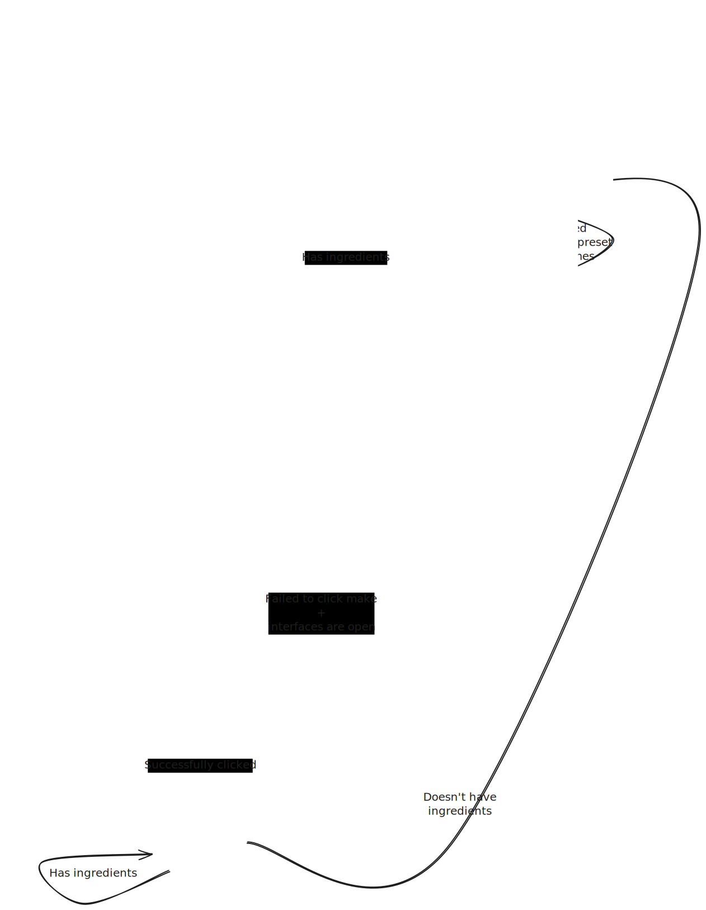

# InkMeDaddy

Ghostly ink maker.

## Build instructions:
`./gradlew build`

## A note on states in this script
States are implemented slightly differently than most scripts.

We're trying to model actual [Finite-state machines](https://en.wikipedia.org/wiki/Finite-state_machine). Unfortunately, we don't really get that due to the fact we need to reach out and determine the state through the BWU API. This is the next-best approach, in that we make our states `process` method define how the state transitions work.

Below is the state machine we've cosntructed.

